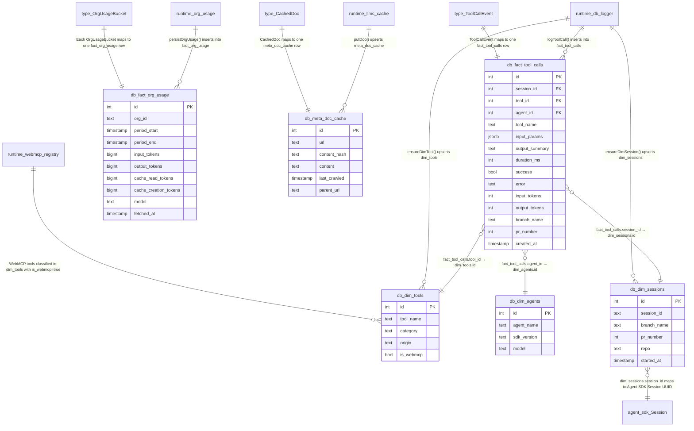

```mermaid
erDiagram

  %% ── EXTERNAL LAYER ──
  external_neon_postgres {
    string DATABASE_URL
    string NEON_API_KEY
    string NEON_PROJECT_ID
  }

  external_claude_organizations_api {
    string ANTHROPIC_ORG_API_KEY
    string ANTHROPIC_ORG_ID
    string anthropic-version
  }

  external_anthropic_docs {
    array entryUrls
  }

  external_claude_code_action {
    string claude_code_oauth_token
  }

  %% ── RELATIONSHIPS ──
  runtime_db_client }o--|| external_neon_postgres : "Drizzle ORM connects via DATABASE_URL"
  runtime_org_usage }o--|| external_claude_organizations_api : "fetchOrgUsage() calls Anthropic Organizations API"
  runtime_llms_crawler }o--|| external_anthropic_docs : "Crawler fetches from docs.anthropic.com allowlist"
  infra_ci ||--|| external_neon_postgres : "CI creates ephemeral Neon branch pr-{number}"
  infra_neon_cleanup ||--|| external_neon_postgres : "Cleanup deletes ephemeral Neon branch on PR close"
  infra_architecture_guardrails ||--|| external_claude_code_action : "Guardrails uses claude-code-action@v1 for review"
  infra_staff_review ||--|| external_claude_code_action : "Staff review uses claude-code-action@v1"
  infra_ci_autofix ||--|| external_claude_code_action : "Auto-fix uses claude-code-action@v1 to diagnose + fix"
  infra_issue_triage ||--|| external_claude_code_action : "Issue triage uses claude-code-action@v1"
  infra_weekly_audit ||--|| external_claude_code_action : "Weekly audit uses claude-code-action@v1"
```

# knowledge-teams-plugins Entity Relationship Diagram — Entity Relationship Diagrams

> Auto-generated from `docs/er/entities.ts` (machine-readable source of truth)
> Generated: 2026-03-11T00:00:00Z | Source: `claude/research-claude-sdk-agents-oVAul`
> **Do not edit this file** — edit `docs/er/entities.ts` and re-run the adapter.

## Complete ER Diagram

```mermaid
erDiagram

  %% ── DATA LAYER ──
  db_dim_tools {
    int id PK
    text tool_name
    text category
    text origin
    bool is_webmcp
  }

  db_dim_agents {
    int id PK
    text agent_name
    text sdk_version
    text model
  }

  db_dim_sessions {
    int id PK
    text session_id
    text branch_name
    int pr_number
    text repo
    timestamp started_at
  }

  db_fact_tool_calls {
    int id PK
    int session_id FK
    int tool_id FK
    int agent_id FK
    text tool_name
    jsonb input_params
    text output_summary
    int duration_ms
    bool success
    text error
    int input_tokens
    int output_tokens
    text branch_name
    int pr_number
    timestamp created_at
  }

  db_fact_org_usage {
    int id PK
    text org_id
    timestamp period_start
    timestamp period_end
    bigint input_tokens
    bigint output_tokens
    bigint cache_read_tokens
    bigint cache_creation_tokens
    text model
    timestamp fetched_at
  }

  db_meta_doc_cache {
    int id PK
    text url
    text content_hash
    text content
    timestamp last_crawled
    text parent_url
  }

  %% ── TYPE LAYER ──
  type_McpServerEntry {
    string id
    string name
    string description
    enum origin
    enum transport
    enum category
    string npmPackage
    string pinnedVersion
    string repo
    array domains
    bool builtIn
    enum implLanguage
    array canonicalSdkPackages
  }

  type_CanonicalPackage {
    string name
    string version
    enum registry
    enum language
    bool installed
  }

  type_LanguageAnalyzer {
    enum language
    string displayName
    array fileExtensions
    enum agentSdkSupport
    bool anthropicSdkAvailable
    bool mcpSdkAvailable
    array knowledgeWorkerPackages
    bool treeSitterSupport
    array recommendedMcps
  }

  type_WebMCPToolDefinition {
    string name
    string description
    object inputSchema
    fn handler
  }

  type_ToolCallEvent {
    string toolName
    string sessionId
    object inputParams
    string outputSummary
    int durationMs
    bool success
    string error
    int inputTokens
    int outputTokens
    string branchName
    int prNumber
  }

  type_TelemetryEvent {
    string toolName
    int timestamp
    int durationMs
    bool success
    string error
  }

  type_TelemetryOptions {
    bool persistToNeon
    string sessionId
    string branchName
    int prNumber
  }

  type_CachedDoc {
    string url
    string content
    string contentHash
    object lastCrawled
    string parentUrl
  }

  type_CrawlResult {
    string url
    string contentHash
    string content
    bool changed
    array childUrls
  }

  type_SyncReport {
    array updated
    array unchanged
    array errors
  }

  type_OrgUsageResponse {
    string org_id
    string period_start
    string period_end
    array usage
  }

  type_OrgUsageBucket {
    string model
    int input_tokens
    int output_tokens
    int cache_read_input_tokens
    int cache_creation_input_tokens
  }

  type_UpstreamRef {
    string repo
    string commit
    string syncedAt
  }

  type_LoadedPlugin {
    enum source
    string name
    string basePath
    object manifest
    array skills
    array commands
  }

  type_PluginManifest {
    string name
    string version
    string description
    array skills
    array commands
  }

  type_SecurityTestFrontmatter {
    string id
    enum owasp
    enum severity
    enum attackVector
    string cwe
    array targetFiles
    string threatDescription
    string testDescription
    enum priorProbability
    enum bayesianImpact
    enum phase
    string createdAt
    string author
  }

  type_SecurityCoverageEntry {
    enum owasp
    int testCount
    array testIds
    array targetFiles
    enum highestSeverity
    enum bayesianCoverage
  }

  type_OwaspCategory {
    string A01
    string A02
    string A03
    string A10
  }

  type_AttackVector {
    string NETWORK
    string PROMPT_INJECTION
    string SUPPLY_CHAIN
    string LOCAL
  }

  %% ── RUNTIME LAYER ──
  runtime_db_client {
    object cachedDb
  }

  runtime_db_logger {
  }

  runtime_org_usage {
  }

  runtime_llms_cache {
    object lru
  }

  runtime_llms_crawler {
    object CRAWLER_ALLOWLIST
    array ALLOWED_DOMAINS
    array ENTRY_URLS
  }

  runtime_llms_sync {
  }

  runtime_mcp_registry {
    array MCP_SERVERS
    array ANTHROPIC_PACKAGES
    array MCP_PACKAGES
    object MCP_SDKS_BY_LANGUAGE
  }

  runtime_language_analyzers {
    array LANGUAGE_ANALYZERS
  }

  runtime_webmcp_registry {
    object registry
  }

  runtime_telemetry {
    array events
  }

  runtime_compose_loader {
  }

  runtime_skeptical_team {
    object agents
    string LEAD_PROMPT
  }

  runtime_security_tdd {
    fn parseSecurityFrontmatter
    fn computeCoverageMatrix
    fn computeBayesianConfidence
  }

  %% ── AGENT-SDK LAYER ──
  agent_sdk_query {
    string prompt
    string options.model
    string options.cwd
    object options.agents
    array options.tools
    array options.allowedTools
    string options.permissionMode
    int options.maxTurns
    object options.systemPrompt
  }

  agent_sdk_AgentDefinition {
    string description
    string model
    array tools
    int maxTurns
    string prompt
  }

  agent_sdk_message_types {
    object assistant
    object user
    object result.success
    object result.error
    object system.init
    object stream_event
    object compact_boundary
  }

  agent_sdk_Session {
    string sessionId
    string summary
    timestamp lastModified
    int fileSize
    string customTitle
    string firstPrompt
    string gitBranch
    string cwd
  }

  agent_sdk_SessionOptions {
    string resume
    bool continue
    bool forkSession
    bool persistSession
    string sessionId
  }

  agent_sdk_HookSystem {
    string PreToolUse
    string PostToolUse
    string PostToolUseFailure
    string Notification
    string UserPromptSubmit
    string SessionStart
    string SessionEnd
    string Stop
    string SubagentStart
    string SubagentStop
    string PermissionRequest
  }

  agent_sdk_PermissionSystem {
    enum permissionMode
    fn canUseTool
    object PermissionResult.allow
    object PermissionResult.deny
  }

  %% ── INFRA LAYER ──
  infra_ci {
    string trigger
    string neonBranch
  }

  infra_neon_cleanup {
    string trigger
  }

  infra_architecture_guardrails {
    string trigger
    enum verdict
  }

  infra_staff_review {
    string trigger
  }

  infra_ci_autofix {
    string trigger
  }

  infra_issue_triage {
    string trigger
  }

  infra_weekly_audit {
    string trigger
  }

  %% ── EXTERNAL LAYER ──
  external_neon_postgres {
    string DATABASE_URL
    string NEON_API_KEY
    string NEON_PROJECT_ID
  }

  external_claude_organizations_api {
    string ANTHROPIC_ORG_API_KEY
    string ANTHROPIC_ORG_ID
    string anthropic-version
  }

  external_anthropic_docs {
    array entryUrls
  }

  external_claude_code_action {
    string claude_code_oauth_token
  }

  %% ── RELATIONSHIPS ──
  db_fact_tool_calls }o--|| db_dim_sessions : "fact_tool_calls.session_id → dim_sessions.id"
  db_fact_tool_calls }o--|| db_dim_tools : "fact_tool_calls.tool_id → dim_tools.id"
  db_fact_tool_calls }o--|| db_dim_agents : "fact_tool_calls.agent_id → dim_agents.id"
  runtime_db_logger ||--o{ db_fact_tool_calls : "logToolCall() inserts into fact_tool_calls"
  runtime_db_logger ||--o{ db_dim_tools : "ensureDimTool() upserts dim_tools"
  runtime_db_logger ||--o{ db_dim_sessions : "ensureDimSession() upserts dim_sessions"
  runtime_org_usage ||--o{ db_fact_org_usage : "persistOrgUsage() inserts into fact_org_usage"
  runtime_llms_cache ||--o{ db_meta_doc_cache : "putDoc() upserts meta_doc_cache"
  runtime_db_logger }o--|| runtime_db_client : "Logger calls getDb() for Drizzle instance"
  runtime_org_usage }o--|| runtime_db_client : "Org usage calls getDb() for Drizzle instance"
  runtime_llms_cache }o--|| runtime_db_client : "Cache reads/writes via getDb()"
  runtime_llms_sync ||--|| runtime_llms_crawler : "Sync orchestrator invokes crawler"
  runtime_llms_sync ||--|| runtime_llms_cache : "Sync orchestrator updates cache"
  runtime_telemetry }o--|| runtime_db_logger : "recordInvocation() optionally calls logToolCall()"
  runtime_language_analyzers }o--|| runtime_mcp_registry : "Imports SupportedLanguage, CanonicalPackage, MCP_SDKS_BY_LANGUAGE, getMcpsByDomain"
  runtime_skeptical_team ||--|| agent_sdk_query : "runSkepticalCodegenTeam() calls query() with agents config"
  runtime_skeptical_team ||--o{ agent_sdk_AgentDefinition : "Defines 3 sub-agents: type-auditor, dead-code-hunter, simplicity-enforcer"
  agent_sdk_query ||--o{ agent_sdk_AgentDefinition : "query() options.agents receives AgentDefinition records"
  agent_sdk_query ||--o{ agent_sdk_message_types : "query() async iterator yields message types"
  type_McpServerEntry ||--o{ type_CanonicalPackage : "McpServerEntry.canonicalSdkPackages → CanonicalPackage[]"
  type_LanguageAnalyzer ||--o{ type_CanonicalPackage : "LanguageAnalyzer.knowledgeWorkerPackages → CanonicalPackage[]"
  type_LanguageAnalyzer }o--o{ type_McpServerEntry : "LanguageAnalyzer.recommendedMcps references McpServerEntry.id"
  type_ToolCallEvent ||--|| db_fact_tool_calls : "ToolCallEvent maps to one fact_tool_calls row"
  type_TelemetryEvent ||--|| type_ToolCallEvent : "TelemetryEvent is converted to ToolCallEvent for Neon persistence"
  type_CrawlResult ||--|| type_CachedDoc : "CrawlResult is transformed into CachedDoc for storage"
  type_CachedDoc ||--|| db_meta_doc_cache : "CachedDoc maps to one meta_doc_cache row"
  type_OrgUsageResponse ||--o{ type_OrgUsageBucket : "OrgUsageResponse.usage contains OrgUsageBucket[]"
  type_OrgUsageBucket ||--|| db_fact_org_usage : "Each OrgUsageBucket maps to one fact_org_usage row"
  type_LoadedPlugin ||--o| type_PluginManifest : "LoadedPlugin.manifest contains optional PluginManifest"
  runtime_db_client }o--|| external_neon_postgres : "Drizzle ORM connects via DATABASE_URL"
  runtime_org_usage }o--|| external_claude_organizations_api : "fetchOrgUsage() calls Anthropic Organizations API"
  runtime_llms_crawler }o--|| external_anthropic_docs : "Crawler fetches from docs.anthropic.com allowlist"
  infra_ci ||--|| external_neon_postgres : "CI creates ephemeral Neon branch pr-{number}"
  infra_neon_cleanup ||--|| external_neon_postgres : "Cleanup deletes ephemeral Neon branch on PR close"
  infra_architecture_guardrails ||--|| external_claude_code_action : "Guardrails uses claude-code-action@v1 for review"
  infra_staff_review ||--|| external_claude_code_action : "Staff review uses claude-code-action@v1"
  infra_ci_autofix ||--|| external_claude_code_action : "Auto-fix uses claude-code-action@v1 to diagnose + fix"
  infra_issue_triage ||--|| external_claude_code_action : "Issue triage uses claude-code-action@v1"
  infra_weekly_audit ||--|| external_claude_code_action : "Weekly audit uses claude-code-action@v1"
  infra_weekly_audit ||--|| runtime_llms_sync : "Weekly audit runs npm run llms:sync"
  infra_architecture_guardrails ||--|| runtime_mcp_registry : "Guardrails reads mcp-registry.ts for canonical types and versions"
  infra_staff_review ||--|| runtime_mcp_registry : "Staff review checks package drift against ANTHROPIC_PACKAGES/MCP_PACKAGES"
  runtime_webmcp_registry ||--o{ db_dim_tools : "WebMCP tools classified in dim_tools with is_webmcp=true"
  agent_sdk_query ||--|| agent_sdk_Session : "query() creates or resumes a Session (persisted .jsonl)"
  agent_sdk_SessionOptions }o--|| agent_sdk_Session : "SessionOptions.resume/continue/forkSession target a Session"
  agent_sdk_Session ||--o{ agent_sdk_message_types : "Session .jsonl persists ordered SDKMessage history"
  agent_sdk_query ||--|| agent_sdk_HookSystem : "query() options.hooks registers HookCallbackMatcher[] per event"
  agent_sdk_query ||--|| agent_sdk_PermissionSystem : "query() options.permissionMode + canUseTool configure access control"
  agent_sdk_HookSystem }o--|| agent_sdk_Session : "Hook inputs include session_id, transcript_path from BaseHookInput"
  db_dim_sessions }o--|| agent_sdk_Session : "dim_sessions.session_id maps to Agent SDK Session UUID"
  runtime_security_tdd ||--o{ type_SecurityTestFrontmatter : "parseSecurityFrontmatter() extracts SecurityTestFrontmatter from JSDoc"
  runtime_security_tdd ||--o{ type_SecurityCoverageEntry : "computeCoverageMatrix() groups frontmatter into per-OWASP coverage"
  type_SecurityTestFrontmatter }o--|| type_OwaspCategory : "Each test maps to one OWASP Top 10 category"
  type_SecurityTestFrontmatter }o--|| type_AttackVector : "Each test classifies one attack vector"
  type_SecurityCoverageEntry }o--|| type_OwaspCategory : "Each coverage entry tracks one OWASP category"
  runtime_skeptical_team ||--|| runtime_security_tdd : "security-auditor sub-agent enforces Security TDD frontmatter requirements"
```

## Data Layer

> 6 entities, 13 relationships

### dim_tools

`db.dim_tools` — `db/schema.ts`

Dimension table: tool identity and MCP classification

| Attribute | Type | Required | Notes |
|-----------|------|----------|-------|
| id | integer | yes | PK; Auto-increment PK |
| tool_name | text | yes | Unique tool identifier |
| category | text | no | Maps to McpCategory enum |
| origin | text | no | Maps to McpOrigin enum |
| is_webmcp | boolean | yes | default: false; Whether this is a WebMCP tool |

### dim_agents

`db.dim_agents` — `db/schema.ts`

Dimension table: agent identity (name, SDK version, model)

| Attribute | Type | Required | Notes |
|-----------|------|----------|-------|
| id | integer | yes | PK |
| agent_name | text | yes |  |
| sdk_version | text | no | claude-agent-sdk version |
| model | text | no | Claude model alias |

### dim_sessions

`db.dim_sessions` — `db/schema.ts`

Dimension table: session context linking to branch, PR, and repo

| Attribute | Type | Required | Notes |
|-----------|------|----------|-------|
| id | integer | yes | PK |
| session_id | text | yes | Unique session identifier |
| branch_name | text | no |  |
| pr_number | integer | no |  |
| repo | text | no |  |
| started_at | timestamp | no | default: now() |

### fact_tool_calls

`db.fact_tool_calls` — `db/schema.ts`

Fact table: individual agent tool call invocations with measures (duration, tokens, success)

| Attribute | Type | Required | Notes |
|-----------|------|----------|-------|
| id | integer | yes | PK |
| session_id | integer | no | FK→`db.dim_sessions` |
| tool_id | integer | no | FK→`db.dim_tools` |
| agent_id | integer | no | FK→`db.dim_agents` |
| tool_name | text | yes |  |
| input_params | jsonb | no |  |
| output_summary | text | no |  |
| duration_ms | integer | no | Measure: execution duration |
| success | boolean | yes |  |
| error | text | no |  |
| input_tokens | integer | no | Measure: input token consumption |
| output_tokens | integer | no | Measure: output token consumption |
| branch_name | text | no |  |
| pr_number | integer | no |  |
| created_at | timestamp | no | default: now() |

### fact_org_usage

`db.fact_org_usage` — `db/schema.ts`

Fact table: Claude Organizations API team usage metrics per model per period

| Attribute | Type | Required | Notes |
|-----------|------|----------|-------|
| id | integer | yes | PK |
| org_id | text | yes |  |
| period_start | timestamp | yes |  |
| period_end | timestamp | yes |  |
| input_tokens | bigint | no | Measure: input tokens consumed |
| output_tokens | bigint | no | Measure: output tokens consumed |
| cache_read_tokens | bigint | no |  |
| cache_creation_tokens | bigint | no |  |
| model | text | no |  |
| fetched_at | timestamp | no | default: now() |

### meta_doc_cache

`db.meta_doc_cache` — `db/schema.ts`

Metadata table: cached llms.txt documents with SHA-256 content hashes

| Attribute | Type | Required | Notes |
|-----------|------|----------|-------|
| id | integer | yes | PK |
| url | text | yes | Unique crawled URL |
| content_hash | text | yes | SHA-256 hex digest |
| content | text | yes |  |
| last_crawled | timestamp | no | default: now() |
| parent_url | text | no | Which llms.txt entry linked here |

#### Diagram



## Type Layer

> 19 entities, 15 relationships

### McpServerEntry

`type.McpServerEntry` — `src/mcp-registry.ts`

Canonical MCP server definition with origin, transport, category, and domain classification

| Attribute | Type | Required | Notes |
|-----------|------|----------|-------|
| id | string | yes | Unique server identifier |
| name | string | yes |  |
| description | string | yes |  |
| origin | enum | yes | enum: reference, anthropic-first-party, official-integration, community |
| transport | enum | yes | enum: stdio, sse, http, streamable-http, sdk |
| category | enum | yes | enum: filesystem, search, database, version-control, browser, memory, reasoning, productivity, communication, cloud, analytics, design, security, monitoring, finance, reference, build-tools |
| npmPackage | string | no |  |
| pinnedVersion | string | no |  |
| repo | string | no |  |
| domains | array | yes | WorkDomain[] — which plugin layers recommend this |
| builtIn | boolean | no |  |
| implLanguage | enum | no | enum: typescript, javascript, python, rust, go, java, csharp, swift, ruby, php, cpp, c, kotlin, scala, elixir, shell |
| canonicalSdkPackages | array | no | CanonicalPackage[] for this MCP's ecosystem |

### CanonicalPackage

`type.CanonicalPackage` — `src/mcp-registry.ts`

Pinned SDK/library package with registry and language metadata

| Attribute | Type | Required | Notes |
|-----------|------|----------|-------|
| name | string | yes |  |
| version | string | yes |  |
| registry | enum | yes | enum: npm, pypi, cargo, go, maven, nuget, rubygems |
| language | enum | yes | enum: typescript, javascript, python, rust, go, java, csharp, swift, ruby, php, cpp, c, kotlin, scala, elixir, shell |
| installed | boolean | yes |  |

### LanguageAnalyzer

`type.LanguageAnalyzer` — `src/language-analyzers.ts`

Language-specific package/MCP mapping for knowledge workers using Claude Agent SDK

| Attribute | Type | Required | Notes |
|-----------|------|----------|-------|
| language | enum | yes | enum: typescript, javascript, python, rust, go, java, csharp, swift, ruby, php, cpp, c, kotlin, scala, elixir, shell |
| displayName | string | yes |  |
| fileExtensions | array | yes |  |
| agentSdkSupport | enum | yes | enum: native, sdk-available, community, none |
| anthropicSdkAvailable | boolean | yes |  |
| mcpSdkAvailable | boolean | yes |  |
| knowledgeWorkerPackages | array | yes | CanonicalPackage[] |
| treeSitterSupport | boolean | yes |  |
| recommendedMcps | array | yes | MCP server IDs |

### WebMCPToolDefinition

`type.WebMCPToolDefinition` — `webmcp/shared/register.ts`

WebMCP tool contract: name, description, Zod input schema, async handler

| Attribute | Type | Required | Notes |
|-----------|------|----------|-------|
| name | string | yes |  |
| description | string | yes |  |
| inputSchema | object | yes | ZodType<T> schema |
| handler | function | yes | (input: T) => Promise<unknown> |

### ToolCallEvent

`type.ToolCallEvent` — `db/logger.ts`

Event payload for logging a tool invocation to Neon

| Attribute | Type | Required | Notes |
|-----------|------|----------|-------|
| toolName | string | yes |  |
| sessionId | string | no |  |
| inputParams | object | no |  |
| outputSummary | string | no |  |
| durationMs | integer | no |  |
| success | boolean | yes |  |
| error | string | no |  |
| inputTokens | integer | no |  |
| outputTokens | integer | no |  |
| branchName | string | no |  |
| prNumber | integer | no |  |

### TelemetryEvent

`type.TelemetryEvent` — `webmcp/shared/telemetry.ts`

In-memory telemetry event with optional Neon persistence

| Attribute | Type | Required | Notes |
|-----------|------|----------|-------|
| toolName | string | yes |  |
| timestamp | integer | yes |  |
| durationMs | integer | yes |  |
| success | boolean | yes |  |
| error | string | no |  |

### TelemetryOptions

`type.TelemetryOptions` — `webmcp/shared/telemetry.ts`

Configuration for telemetry persistence (Neon + session context)

| Attribute | Type | Required | Notes |
|-----------|------|----------|-------|
| persistToNeon | boolean | no |  |
| sessionId | string | no |  |
| branchName | string | no |  |
| prNumber | integer | no |  |

### CachedDoc

`type.CachedDoc` — `lib/llms-cache.ts`

Cached llms.txt document with content hash for change detection

| Attribute | Type | Required | Notes |
|-----------|------|----------|-------|
| url | string | yes |  |
| content | string | yes |  |
| contentHash | string | yes | SHA-256 hex |
| lastCrawled | object | yes | Date |
| parentUrl | string | no |  |

### CrawlResult

`type.CrawlResult` — `lib/llms-crawler.ts`

Result of crawling a single URL with hash comparison and child link extraction

| Attribute | Type | Required | Notes |
|-----------|------|----------|-------|
| url | string | yes |  |
| contentHash | string | yes |  |
| content | string | yes |  |
| changed | boolean | yes |  |
| childUrls | array | yes |  |

### SyncReport

`type.SyncReport` — `lib/llms-sync.ts`

Sync orchestration result summarizing updated, unchanged, and errored URLs

| Attribute | Type | Required | Notes |
|-----------|------|----------|-------|
| updated | array | yes | string[] — URLs that changed |
| unchanged | array | yes | string[] — URLs with same hash |
| errors | array | yes | string[] — error messages |

### OrgUsageResponse

`type.OrgUsageResponse` — `db/org-usage.ts`

Claude Organizations API response with usage buckets per model

| Attribute | Type | Required | Notes |
|-----------|------|----------|-------|
| org_id | string | yes |  |
| period_start | string | yes | ISO 8601 |
| period_end | string | yes | ISO 8601 |
| usage | array | yes | OrgUsageBucket[] |

### OrgUsageBucket

`type.OrgUsageBucket` — `db/org-usage.ts`

Single model usage bucket with token counts and cache metrics

| Attribute | Type | Required | Notes |
|-----------|------|----------|-------|
| model | string | yes |  |
| input_tokens | integer | yes |  |
| output_tokens | integer | yes |  |
| cache_read_input_tokens | integer | no |  |
| cache_creation_input_tokens | integer | no |  |

### UpstreamRef

`type.UpstreamRef` — `compose/loader.ts`

Pinned upstream repository reference (repo, commit hash, sync timestamp)

| Attribute | Type | Required | Notes |
|-----------|------|----------|-------|
| repo | string | yes |  |
| commit | string | yes |  |
| syncedAt | string | yes |  |

### LoadedPlugin

`type.LoadedPlugin` — `compose/loader.ts`

A loaded plugin from either upstream or jade extensions with manifest, skills, and commands

| Attribute | Type | Required | Notes |
|-----------|------|----------|-------|
| source | enum | yes | enum: upstream, jade |
| name | string | yes |  |
| basePath | string | yes |  |
| manifest | object | no | PluginManifest | null |
| skills | array | yes | string[] — .md file paths |
| commands | array | yes | string[] — .md file paths |

### PluginManifest

`type.PluginManifest` — `compose/loader.ts`

Plugin metadata from plugin.json (name, version, description, skills, commands)

| Attribute | Type | Required | Notes |
|-----------|------|----------|-------|
| name | string | yes |  |
| version | string | no |  |
| description | string | no |  |
| skills | array | no |  |
| commands | array | no |  |

### SecurityTestFrontmatter

`type.SecurityTestFrontmatter` — `lib/security-tdd.ts`

Frontmatter per security test: OWASP category, CWE, Bayesian impact, attack vector

| Attribute | Type | Required | Notes |
|-----------|------|----------|-------|
| id | string | yes | Unique test ID (e.g., SEC-CRAWLER-001) |
| owasp | enum | yes | OWASP Top 10 2021 category |
| severity | enum | yes | CVSS-aligned: critical|high|medium|low|info |
| attackVector | enum | yes | network|adjacent|local|physical|prompt-injection|supply-chain |
| cwe | string | no | CWE identifier (e.g., CWE-918) |
| targetFiles | array | yes | Source files under test |
| threatDescription | string | yes | What the attacker would try |
| testDescription | string | yes | What the test validates |
| priorProbability | enum | yes | P(attack attempt): high|medium|low |
| bayesianImpact | enum | yes | Expected reduction in P(success): high|medium|low |
| phase | enum | yes | Security TDD phase: red|green|secure|refactor |
| createdAt | string | yes | ISO date |
| author | string | yes | Agent or human author |

### SecurityCoverageEntry

`type.SecurityCoverageEntry` — `lib/security-tdd.ts`

Per-OWASP-category coverage metrics with Bayesian confidence level

| Attribute | Type | Required | Notes |
|-----------|------|----------|-------|
| owasp | enum | yes | OWASP category |
| testCount | integer | yes | Number of tests covering this category |
| testIds | array | yes | SEC-* IDs of covering tests |
| targetFiles | array | yes | All files tested under this category |
| highestSeverity | enum | yes | Most severe finding level |
| bayesianCoverage | enum | yes | strong|moderate|weak|none |

### OwaspCategory

`type.OwaspCategory` — `lib/security-tdd.ts`

Enum: OWASP Top 10 2021 categories (A01-A10)

| Attribute | Type | Required | Notes |
|-----------|------|----------|-------|
| A01 | string | yes | Broken Access Control |
| A02 | string | yes | Cryptographic Failures |
| A03 | string | yes | Injection |
| A10 | string | yes | Server-Side Request Forgery |

### AttackVector

`type.AttackVector` — `lib/security-tdd.ts`

Enum: attack vector classification including prompt-injection and supply-chain

| Attribute | Type | Required | Notes |
|-----------|------|----------|-------|
| NETWORK | string | yes | API/HTTP input |
| PROMPT_INJECTION | string | yes | LLM prompt manipulation |
| SUPPLY_CHAIN | string | yes | Upstream dependency compromise |
| LOCAL | string | yes | Env vars, filesystem |

#### Diagram



```mermaid
erDiagram

  %% ── TYPE LAYER ──
  type_McpServerEntry {
    string id
    string name
    string description
    enum origin
    enum transport
    enum category
    string npmPackage
    string pinnedVersion
    string repo
    array domains
    bool builtIn
    enum implLanguage
    array canonicalSdkPackages
  }

  type_CanonicalPackage {
    string name
    string version
    enum registry
    enum language
    bool installed
  }

  type_LanguageAnalyzer {
    enum language
    string displayName
    array fileExtensions
    enum agentSdkSupport
    bool anthropicSdkAvailable
    bool mcpSdkAvailable
    array knowledgeWorkerPackages
    bool treeSitterSupport
    array recommendedMcps
  }

  type_WebMCPToolDefinition {
    string name
    string description
    object inputSchema
    fn handler
  }

  type_ToolCallEvent {
    string toolName
    string sessionId
    object inputParams
    string outputSummary
    int durationMs
    bool success
    string error
    int inputTokens
    int outputTokens
    string branchName
    int prNumber
  }

  type_TelemetryEvent {
    string toolName
    int timestamp
    int durationMs
    bool success
    string error
  }

  type_TelemetryOptions {
    bool persistToNeon
    string sessionId
    string branchName
    int prNumber
  }

  type_CachedDoc {
    string url
    string content
    string contentHash
    object lastCrawled
    string parentUrl
  }

  type_CrawlResult {
    string url
    string contentHash
    string content
    bool changed
    array childUrls
  }

  type_SyncReport {
    array updated
    array unchanged
    array errors
  }

  type_OrgUsageResponse {
    string org_id
    string period_start
    string period_end
    array usage
  }

  type_OrgUsageBucket {
    string model
    int input_tokens
    int output_tokens
    int cache_read_input_tokens
    int cache_creation_input_tokens
  }

  type_UpstreamRef {
    string repo
    string commit
    string syncedAt
  }

  type_LoadedPlugin {
    enum source
    string name
    string basePath
    object manifest
    array skills
    array commands
  }

  type_PluginManifest {
    string name
    string version
    string description
    array skills
    array commands
  }

  type_SecurityTestFrontmatter {
    string id
    enum owasp
    enum severity
    enum attackVector
    string cwe
    array targetFiles
    string threatDescription
    string testDescription
    enum priorProbability
    enum bayesianImpact
    enum phase
    string createdAt
    string author
  }

  type_SecurityCoverageEntry {
    enum owasp
    int testCount
    array testIds
    array targetFiles
    enum highestSeverity
    enum bayesianCoverage
  }

  type_OwaspCategory {
    string A01
    string A02
    string A03
    string A10
  }

  type_AttackVector {
    string NETWORK
    string PROMPT_INJECTION
    string SUPPLY_CHAIN
    string LOCAL
  }

  %% ── RELATIONSHIPS ──
  type_McpServerEntry ||--o{ type_CanonicalPackage : "McpServerEntry.canonicalSdkPackages → CanonicalPackage[]"
  type_LanguageAnalyzer ||--o{ type_CanonicalPackage : "LanguageAnalyzer.knowledgeWorkerPackages → CanonicalPackage[]"
  type_LanguageAnalyzer }o--o{ type_McpServerEntry : "LanguageAnalyzer.recommendedMcps references McpServerEntry.id"
  type_ToolCallEvent ||--|| db_fact_tool_calls : "ToolCallEvent maps to one fact_tool_calls row"
  type_TelemetryEvent ||--|| type_ToolCallEvent : "TelemetryEvent is converted to ToolCallEvent for Neon persistence"
  type_CrawlResult ||--|| type_CachedDoc : "CrawlResult is transformed into CachedDoc for storage"
  type_CachedDoc ||--|| db_meta_doc_cache : "CachedDoc maps to one meta_doc_cache row"
  type_OrgUsageResponse ||--o{ type_OrgUsageBucket : "OrgUsageResponse.usage contains OrgUsageBucket[]"
  type_OrgUsageBucket ||--|| db_fact_org_usage : "Each OrgUsageBucket maps to one fact_org_usage row"
  type_LoadedPlugin ||--o| type_PluginManifest : "LoadedPlugin.manifest contains optional PluginManifest"
  runtime_security_tdd ||--o{ type_SecurityTestFrontmatter : "parseSecurityFrontmatter() extracts SecurityTestFrontmatter from JSDoc"
  runtime_security_tdd ||--o{ type_SecurityCoverageEntry : "computeCoverageMatrix() groups frontmatter into per-OWASP coverage"
  type_SecurityTestFrontmatter }o--|| type_OwaspCategory : "Each test maps to one OWASP Top 10 category"
  type_SecurityTestFrontmatter }o--|| type_AttackVector : "Each test classifies one attack vector"
  type_SecurityCoverageEntry }o--|| type_OwaspCategory : "Each coverage entry tracks one OWASP category"
```

## Runtime Layer

> 13 entities, 24 relationships

### Database Client

`runtime.db_client` — `db/client.ts`

Singleton Neon serverless Drizzle ORM client with lazy initialization

| Attribute | Type | Required | Notes |
|-----------|------|----------|-------|
| cachedDb | object | no | NeonHttpDatabase<schema> singleton |

**Functions:**

- `getDb()`: `NeonHttpDatabase<typeof schema>` — Returns cached Drizzle ORM instance connected to Neon
- `hasDatabase()`: `boolean` — Returns true if DATABASE_URL is configured

### Tool Call Logger

`runtime.db_logger` — `db/logger.ts`

Persists agent tool call events to Neon via dimension upserts + fact inserts

**Functions:**

- `ensureDimTool(toolName, category?, origin?, isWebmcp?)`: `Promise<number>` — Upsert tool into dim_tools, returns row ID
- `ensureDimSession(sessionId, branchName?, prNumber?, repo?)`: `Promise<number>` — Upsert session into dim_sessions, returns row ID
- `logToolCall(event: ToolCallEvent)`: `Promise<void>` — Log tool call to fact_tool_calls; no-op if DATABASE_URL unset

### Org Usage Fetcher

`runtime.org_usage` — `db/org-usage.ts`

Fetches Claude Organizations API usage and persists to fact_org_usage

**Functions:**

- `fetchOrgUsage(orgId, apiKey)`: `Promise<OrgUsageResponse>` — Fetch usage from Anthropic Organizations API
- `persistOrgUsage(usage: OrgUsageResponse)`: `Promise<number>` — Write usage buckets to fact_org_usage
- `syncOrgUsage()`: `Promise<{fetched, persisted}>` — End-to-end fetch + persist orchestrator

### Two-Tier Doc Cache

`runtime.llms_cache` — `lib/llms-cache.ts`

LRU (in-memory, 100 entries) + Neon (persistent) cache for llms.txt docs

| Attribute | Type | Required | Notes |
|-----------|------|----------|-------|
| lru | object | yes | LRUCache<string, CachedDoc> with max=100 |

**Functions:**

- `getDoc(url)`: `CachedDoc | undefined` — LRU-only lookup
- `getDocWithFallback(url)`: `Promise<CachedDoc | undefined>` — LRU then Neon fallback
- `putDoc(doc: CachedDoc)`: `Promise<void>` — Write to both LRU and Neon
- `refreshIfStale(url, maxAgeMs)`: `Promise<CachedDoc | undefined>` — Return cached doc if fresh, undefined if stale
- `clearLruCache()`: `void` — Clear LRU (testing)

### llms.txt Crawler

`runtime.llms_crawler` — `lib/llms-crawler.ts`

Multi-sig governed crawler with SSRF defense, base64/SQL injection protection

| Attribute | Type | Required | Notes |
|-----------|------|----------|-------|
| CRAWLER_ALLOWLIST | object | yes | Categorized allowlist: claude-platform, neon-database, vercel-platform |
| ALLOWED_DOMAINS | array | yes | [docs.anthropic.com, claude.ai, neon.tech, vercel.com] |
| ENTRY_URLS | array | yes | llms.txt entry points per approved domain |

**Functions:**

- `isAllowedUrl(url)`: `boolean` — Security boundary: only allowlisted domains
- `getEntryUrls()`: `readonly string[]` — Returns entry point URLs
- `fetchLlmsTxt(url)`: `Promise<string>` — Fetch raw text from allowlisted URL
- `hashContent(content)`: `string` — SHA-256 hex hash
- `extractUrls(llmsTxt)`: `string[]` — Extract URLs from llms.txt content
- `crawlUrl(url, knownHash)`: `Promise<CrawlResult>` — Crawl single URL with hash comparison
- `crawlRecursive(entryUrl, knownHashes, maxDepth?)`: `Promise<CrawlResult[]>` — Recursive crawl with depth limit

### llms.txt Sync Orchestrator

`runtime.llms_sync` — `lib/llms-sync.ts`

Orchestrates crawl + cache update across all entry URLs

**Functions:**

- `syncDocs()`: `Promise<SyncReport>` — Crawl all entries, compare hashes, update cache

### MCP Registry

`runtime.mcp_registry` — `src/mcp-registry.ts`

Dynamic MCP registry with 47 servers, canonical enums, package pinning, and cross-domain bridge mappings

| Attribute | Type | Required | Notes |
|-----------|------|----------|-------|
| MCP_SERVERS | array | yes | McpServerEntry[] — 47 registered servers |
| ANTHROPIC_PACKAGES | array | yes | CanonicalPackage[] — 10 @anthropic-ai packages |
| MCP_PACKAGES | array | yes | CanonicalPackage[] — 8 @modelcontextprotocol packages |
| MCP_SDKS_BY_LANGUAGE | object | yes | Record<SupportedLanguage, CanonicalPackage[]> |

**Functions:**

- `getMcpsByDomain(domain: WorkDomain)`: `McpServerEntry[]` — Filter servers by work domain
- `getMcpsByCategory(category: McpCategory)`: `McpServerEntry[]` — Filter servers by category
- `getMcpsByOrigin(origin: McpOrigin)`: `McpServerEntry[]` — Filter servers by origin
- `getSdkPackagesForLanguage(lang: SupportedLanguage)`: `CanonicalPackage[]` — Get SDK packages for a language
- `getInstalledPackages()`: `CanonicalPackage[]` — All installed canonical packages
- `getMonitoredPackages()`: `Array<{name, current, registry}>` — Packages needing version monitoring
- `getMcpById(id: string)`: `McpServerEntry | undefined` — Resolve MCP server by ID

### Language Analyzer Registry

`runtime.language_analyzers` — `src/language-analyzers.ts`

14-language analyzer registry mapping file extensions to SDK support, packages, and MCP recommendations

| Attribute | Type | Required | Notes |
|-----------|------|----------|-------|
| LANGUAGE_ANALYZERS | array | yes | LanguageAnalyzer[] — 14 entries |

**Functions:**

- `getAnalyzerForExtension(ext: string)`: `LanguageAnalyzer | undefined` — Get analyzer by file extension
- `getNativeAgentSdkLanguages()`: `LanguageAnalyzer[]` — Languages with native Agent SDK support
- `getMcpSdkLanguages()`: `LanguageAnalyzer[]` — Languages with MCP SDK available
- `getKnowledgeWorkerStack(lang: SupportedLanguage)`: `{packages, mcps, agentSdkSupport}` — Full stack for a language

### WebMCP Tool Registry

`runtime.webmcp_registry` — `webmcp/shared/register.ts`

Module-level Map<string, WebMCPToolDefinition> with register/get/list operations

| Attribute | Type | Required | Notes |
|-----------|------|----------|-------|
| registry | object | yes | Map<string, WebMCPToolDefinition> |

**Functions:**

- `registerTool(tool: WebMCPToolDefinition<T>)`: `void` — Register tool; throws on duplicate name
- `getTool(name: string)`: `WebMCPToolDefinition | undefined` — Retrieve tool by name
- `listTools()`: `string[]` — List all registered tool names
- `clearRegistry()`: `void` — Clear registry (testing)

### Telemetry Recorder

`runtime.telemetry` — `webmcp/shared/telemetry.ts`

In-memory telemetry with optional Neon persistence bridge

| Attribute | Type | Required | Notes |
|-----------|------|----------|-------|
| events | array | yes | TelemetryEvent[] — in-memory buffer |

**Functions:**

- `recordInvocation(event, options?)`: `void` — Record event; optionally persist to Neon
- `getEvents()`: `readonly TelemetryEvent[]` — Get all recorded events
- `clearTelemetry()`: `void` — Clear events (testing)

### Plugin Compose Loader

`runtime.compose_loader` — `compose/loader.ts`

Loads and merges upstream KWP + jade extension plugins at build time

**Functions:**

- `loadUpstreamRef(rootDir: string)`: `UpstreamRef` — Load upstream-ref.json
- `scanPluginDir(dir, source)`: `LoadedPlugin[]` — Scan directory for plugin subdirectories
- `loadAll(rootDir: string)`: `{upstreamRef, upstream, jade}` — Load both upstream and jade plugins

### Skeptical Codegen Team

`runtime.skeptical_team` — `src/teams/skeptical-codegen-team.ts`

Multi-agent code review team using @anthropic-ai/claude-agent-sdk with 3 specialist sub-agents

| Attribute | Type | Required | Notes |
|-----------|------|----------|-------|
| agents | object | yes | Record<string, AgentDefinition> — 3 sub-agents |
| LEAD_PROMPT | string | yes | System prompt for lead skeptic |

**Functions:**

- `runSkepticalCodegenTeam(cwd?: string)`: `Promise<void>` — Run full team review via query() streaming

### Security TDD Framework

`runtime.security_tdd` — `lib/security-tdd.ts`

Parses security frontmatter, computes OWASP coverage matrix, Bayesian confidence scoring

| Attribute | Type | Required | Notes |
|-----------|------|----------|-------|
| parseSecurityFrontmatter | function | yes | Extract SecurityTestFrontmatter from JSDoc |
| computeCoverageMatrix | function | yes | Group tests by OWASP category |
| computeBayesianConfidence | function | yes | 0-100 confidence score from coverage matrix |

#### Diagram



```mermaid
erDiagram

  %% ── RUNTIME LAYER ──
  runtime_db_client {
    object cachedDb
  }

  runtime_db_logger {
  }

  runtime_org_usage {
  }

  runtime_llms_cache {
    object lru
  }

  runtime_llms_crawler {
    object CRAWLER_ALLOWLIST
    array ALLOWED_DOMAINS
    array ENTRY_URLS
  }

  runtime_llms_sync {
  }

  runtime_mcp_registry {
    array MCP_SERVERS
    array ANTHROPIC_PACKAGES
    array MCP_PACKAGES
    object MCP_SDKS_BY_LANGUAGE
  }

  runtime_language_analyzers {
    array LANGUAGE_ANALYZERS
  }

  runtime_webmcp_registry {
    object registry
  }

  runtime_telemetry {
    array events
  }

  runtime_compose_loader {
  }

  runtime_skeptical_team {
    object agents
    string LEAD_PROMPT
  }

  runtime_security_tdd {
    fn parseSecurityFrontmatter
    fn computeCoverageMatrix
    fn computeBayesianConfidence
  }

  %% ── RELATIONSHIPS ──
  runtime_db_logger ||--o{ db_fact_tool_calls : "logToolCall() inserts into fact_tool_calls"
  runtime_db_logger ||--o{ db_dim_tools : "ensureDimTool() upserts dim_tools"
  runtime_db_logger ||--o{ db_dim_sessions : "ensureDimSession() upserts dim_sessions"
  runtime_org_usage ||--o{ db_fact_org_usage : "persistOrgUsage() inserts into fact_org_usage"
  runtime_llms_cache ||--o{ db_meta_doc_cache : "putDoc() upserts meta_doc_cache"
  runtime_db_logger }o--|| runtime_db_client : "Logger calls getDb() for Drizzle instance"
  runtime_org_usage }o--|| runtime_db_client : "Org usage calls getDb() for Drizzle instance"
  runtime_llms_cache }o--|| runtime_db_client : "Cache reads/writes via getDb()"
  runtime_llms_sync ||--|| runtime_llms_crawler : "Sync orchestrator invokes crawler"
  runtime_llms_sync ||--|| runtime_llms_cache : "Sync orchestrator updates cache"
  runtime_telemetry }o--|| runtime_db_logger : "recordInvocation() optionally calls logToolCall()"
  runtime_language_analyzers }o--|| runtime_mcp_registry : "Imports SupportedLanguage, CanonicalPackage, MCP_SDKS_BY_LANGUAGE, getMcpsByDomain"
  runtime_skeptical_team ||--|| agent_sdk_query : "runSkepticalCodegenTeam() calls query() with agents config"
  runtime_skeptical_team ||--o{ agent_sdk_AgentDefinition : "Defines 3 sub-agents: type-auditor, dead-code-hunter, simplicity-enforcer"
  runtime_db_client }o--|| external_neon_postgres : "Drizzle ORM connects via DATABASE_URL"
  runtime_org_usage }o--|| external_claude_organizations_api : "fetchOrgUsage() calls Anthropic Organizations API"
  runtime_llms_crawler }o--|| external_anthropic_docs : "Crawler fetches from docs.anthropic.com allowlist"
  infra_weekly_audit ||--|| runtime_llms_sync : "Weekly audit runs npm run llms:sync"
  infra_architecture_guardrails ||--|| runtime_mcp_registry : "Guardrails reads mcp-registry.ts for canonical types and versions"
  infra_staff_review ||--|| runtime_mcp_registry : "Staff review checks package drift against ANTHROPIC_PACKAGES/MCP_PACKAGES"
  runtime_webmcp_registry ||--o{ db_dim_tools : "WebMCP tools classified in dim_tools with is_webmcp=true"
  runtime_security_tdd ||--o{ type_SecurityTestFrontmatter : "parseSecurityFrontmatter() extracts SecurityTestFrontmatter from JSDoc"
  runtime_security_tdd ||--o{ type_SecurityCoverageEntry : "computeCoverageMatrix() groups frontmatter into per-OWASP coverage"
  runtime_skeptical_team ||--|| runtime_security_tdd : "security-auditor sub-agent enforces Security TDD frontmatter requirements"
```

## Agent-sdk Layer

> 7 entities, 11 relationships

### query()

`agent_sdk.query` — `@anthropic-ai/claude-agent-sdk`

Primary Agent SDK entry point: creates a streaming async iterator of agent messages

| Attribute | Type | Required | Notes |
|-----------|------|----------|-------|
| prompt | string | yes | Task prompt |
| options.model | string | yes | Model alias: opus, sonnet, haiku, inherit |
| options.cwd | string | no |  |
| options.agents | object | no | Record<string, AgentDefinition> |
| options.tools | array | no | Tool names to enable |
| options.allowedTools | array | no |  |
| options.permissionMode | string | no |  |
| options.maxTurns | integer | no |  |
| options.systemPrompt | object | no |  |

### AgentDefinition

`agent_sdk.AgentDefinition` — `@anthropic-ai/claude-agent-sdk`

Sub-agent definition spawnable by lead agent via the Agent tool

| Attribute | Type | Required | Notes |
|-----------|------|----------|-------|
| description | string | yes |  |
| model | string | yes | Model alias |
| tools | array | yes | Tool names available to this sub-agent |
| maxTurns | integer | yes |  |
| prompt | string | yes | System prompt |

### Agent Message Types

`agent_sdk.message_types` — `@anthropic-ai/claude-agent-sdk`

Streaming message types emitted by query() async iterator (SDKMessage union)

| Attribute | Type | Required | Notes |
|-----------|------|----------|-------|
| assistant | object | yes | SDKAssistantMessage — wraps BetaMessage with uuid, session_id, parent_tool_use_id |
| user | object | yes | SDKUserMessage — wraps MessageParam with optional tool_use_result |
| result.success | object | yes | num_turns, total_cost_usd, usage, modelUsage, duration_ms, structured_output? |
| result.error | object | yes | subtype: error_max_turns|error_during_execution|error_max_budget_usd, errors[] |
| system.init | object | yes | SDKSystemMessage — tools, agents, mcp_servers, model, permissionMode, claude_code_version |
| stream_event | object | yes | SDKPartialAssistantMessage — real-time streaming content blocks |
| compact_boundary | object | no | SDKCompactBoundaryMessage — context compression trigger with pre_tokens count |

### Session

`agent_sdk.Session` — `@anthropic-ai/claude-agent-sdk`

Persisted conversation state as .jsonl at ~/.claude/projects/<encoded-cwd>/<session-id>.jsonl

| Attribute | Type | Required | Notes |
|-----------|------|----------|-------|
| sessionId | string | yes | UUID identifying this session |
| summary | string | no |  |
| lastModified | timestamp | yes |  |
| fileSize | integer | no |  |
| customTitle | string | no |  |
| firstPrompt | string | no |  |
| gitBranch | string | no |  |
| cwd | string | no |  |

**Functions:**

- `listSessions(cwd?)`: `Promise<SDKSessionInfo[]>` — List all persisted sessions (optionally filtered by cwd)
- `getSessionMessages(sessionId)`: `Promise<SessionMessage[]>` — Read full conversation history from .jsonl file

### Session Options

`agent_sdk.SessionOptions` — `@anthropic-ai/claude-agent-sdk`

Session persistence and resume configuration passed via Options

| Attribute | Type | Required | Notes |
|-----------|------|----------|-------|
| resume | string | no | Session ID to resume |
| continue | boolean | no | Auto-find most recent session in cwd |
| forkSession | boolean | no | Create new session from copy of resumed session history |
| persistSession | boolean | no | false = memory-only (TS only), default true |
| sessionId | string | no | Explicit session ID to use |

### Hook System

`agent_sdk.HookSystem` — `@anthropic-ai/claude-agent-sdk`

17 lifecycle hook events with matcher-based callback registration and sync/async responses

| Attribute | Type | Required | Notes |
|-----------|------|----------|-------|
| PreToolUse | string | no | Before tool execution — can modify input or deny |
| PostToolUse | string | no | After tool execution — can modify output |
| PostToolUseFailure | string | no | After tool failure — error, is_interrupt? |
| Notification | string | no | Agent notifications — message, title?, notification_type |
| UserPromptSubmit | string | no | Before prompt processing — can modify prompt |
| SessionStart | string | no | TS only — source: startup|resume|clear|compact |
| SessionEnd | string | no | TS only — reason: ExitReason |
| Stop | string | no | Agent stop event — last_assistant_message? |
| SubagentStart | string | no | Sub-agent spawned — agent_id, agent_type |
| SubagentStop | string | no | Sub-agent completed — agent_transcript_path |
| PermissionRequest | string | no | Permission prompt — tool_name, tool_input, suggestions? |

### Permission System

`agent_sdk.PermissionSystem` — `@anthropic-ai/claude-agent-sdk`

Permission modes and custom canUseTool callback for tool access control

| Attribute | Type | Required | Notes |
|-----------|------|----------|-------|
| permissionMode | enum | yes | enum: default, acceptEdits, bypassPermissions, plan, dontAsk; Global permission policy |
| canUseTool | function | no | Custom callback: (toolName, input, opts) => Promise<PermissionResult> |
| PermissionResult.allow | object | no | {behavior: 'allow', updatedInput?, updatedPermissions?} |
| PermissionResult.deny | object | no | {behavior: 'deny', message, interrupt?} |

#### Diagram

```mermaid
erDiagram

  %% ── AGENT-SDK LAYER ──
  agent_sdk_query {
    string prompt
    string options.model
    string options.cwd
    object options.agents
    array options.tools
    array options.allowedTools
    string options.permissionMode
    int options.maxTurns
    object options.systemPrompt
  }

  agent_sdk_AgentDefinition {
    string description
    string model
    array tools
    int maxTurns
    string prompt
  }

  agent_sdk_message_types {
    object assistant
    object user
    object result.success
    object result.error
    object system.init
    object stream_event
    object compact_boundary
  }

  agent_sdk_Session {
    string sessionId
    string summary
    timestamp lastModified
    int fileSize
    string customTitle
    string firstPrompt
    string gitBranch
    string cwd
  }

  agent_sdk_SessionOptions {
    string resume
    bool continue
    bool forkSession
    bool persistSession
    string sessionId
  }

  agent_sdk_HookSystem {
    string PreToolUse
    string PostToolUse
    string PostToolUseFailure
    string Notification
    string UserPromptSubmit
    string SessionStart
    string SessionEnd
    string Stop
    string SubagentStart
    string SubagentStop
    string PermissionRequest
  }

  agent_sdk_PermissionSystem {
    enum permissionMode
    fn canUseTool
    object PermissionResult.allow
    object PermissionResult.deny
  }

  %% ── RELATIONSHIPS ──
  runtime_skeptical_team ||--|| agent_sdk_query : "runSkepticalCodegenTeam() calls query() with agents config"
  runtime_skeptical_team ||--o{ agent_sdk_AgentDefinition : "Defines 3 sub-agents: type-auditor, dead-code-hunter, simplicity-enforcer"
  agent_sdk_query ||--o{ agent_sdk_AgentDefinition : "query() options.agents receives AgentDefinition records"
  agent_sdk_query ||--o{ agent_sdk_message_types : "query() async iterator yields message types"
  agent_sdk_query ||--|| agent_sdk_Session : "query() creates or resumes a Session (persisted .jsonl)"
  agent_sdk_SessionOptions }o--|| agent_sdk_Session : "SessionOptions.resume/continue/forkSession target a Session"
  agent_sdk_Session ||--o{ agent_sdk_message_types : "Session .jsonl persists ordered SDKMessage history"
  agent_sdk_query ||--|| agent_sdk_HookSystem : "query() options.hooks registers HookCallbackMatcher[] per event"
  agent_sdk_query ||--|| agent_sdk_PermissionSystem : "query() options.permissionMode + canUseTool configure access control"
  agent_sdk_HookSystem }o--|| agent_sdk_Session : "Hook inputs include session_id, transcript_path from BaseHookInput"
  db_dim_sessions }o--|| agent_sdk_Session : "dim_sessions.session_id maps to Agent SDK Session UUID"
```

## Infra Layer

> 7 entities, 10 relationships

### CI Workflow

`infra.ci` — `.github/workflows/ci.yml`

Build + test + Neon branch-per-PR on push/PR to main

| Attribute | Type | Required | Notes |
|-----------|------|----------|-------|
| trigger | string | yes | push/PR to main |
| neonBranch | string | no | pr-{number} ephemeral branch |

### Neon Branch Cleanup

`infra.neon_cleanup` — `.github/workflows/neon-cleanup.yml`

Delete ephemeral Neon database branch on PR close

| Attribute | Type | Required | Notes |
|-----------|------|----------|-------|
| trigger | string | yes | PR closed |

### Architecture Guardrails

`infra.architecture_guardrails` — `.github/workflows/architecture-guardrails.yml`

Claude-powered architecture review with PASS/REVISIT/BLOCK verdicts

| Attribute | Type | Required | Notes |
|-----------|------|----------|-------|
| trigger | string | yes | PR opened/synchronize/reopened |
| verdict | enum | yes | enum: PASS, PASS with follow-ups, REVISIT, BLOCK |

### Staff Review

`infra.staff_review` — `.github/workflows/staff-review.yml`

SDK-aware code quality review (return types, coverage, naming, drift)

| Attribute | Type | Required | Notes |
|-----------|------|----------|-------|
| trigger | string | yes | PR opened/synchronize/reopened |

### CI Auto-Fix

`infra.ci_autofix` — `.github/workflows/ci-autofix.yml`

Automatically diagnose and fix CI failures on non-main branches

| Attribute | Type | Required | Notes |
|-----------|------|----------|-------|
| trigger | string | yes | CI workflow failure |

### Issue Triage

`infra.issue_triage` — `.github/workflows/issue-triage.yml`

Auto-categorize and label new issues (bug, feature, question, upstream, infra)

| Attribute | Type | Required | Notes |
|-----------|------|----------|-------|
| trigger | string | yes | Issue opened |

### Weekly Audit

`infra.weekly_audit` — `.github/workflows/weekly-audit.yml`

Monday 9am UTC stale code/drift audit + llms.txt cache refresh

| Attribute | Type | Required | Notes |
|-----------|------|----------|-------|
| trigger | string | yes | Cron: Monday 9am UTC + manual |

#### Diagram



```mermaid
erDiagram

  %% ── INFRA LAYER ──
  infra_ci {
    string trigger
    string neonBranch
  }

  infra_neon_cleanup {
    string trigger
  }

  infra_architecture_guardrails {
    string trigger
    enum verdict
  }

  infra_staff_review {
    string trigger
  }

  infra_ci_autofix {
    string trigger
  }

  infra_issue_triage {
    string trigger
  }

  infra_weekly_audit {
    string trigger
  }

  %% ── RELATIONSHIPS ──
  infra_ci ||--|| external_neon_postgres : "CI creates ephemeral Neon branch pr-{number}"
  infra_neon_cleanup ||--|| external_neon_postgres : "Cleanup deletes ephemeral Neon branch on PR close"
  infra_architecture_guardrails ||--|| external_claude_code_action : "Guardrails uses claude-code-action@v1 for review"
  infra_staff_review ||--|| external_claude_code_action : "Staff review uses claude-code-action@v1"
  infra_ci_autofix ||--|| external_claude_code_action : "Auto-fix uses claude-code-action@v1 to diagnose + fix"
  infra_issue_triage ||--|| external_claude_code_action : "Issue triage uses claude-code-action@v1"
  infra_weekly_audit ||--|| external_claude_code_action : "Weekly audit uses claude-code-action@v1"
  infra_weekly_audit ||--|| runtime_llms_sync : "Weekly audit runs npm run llms:sync"
  infra_architecture_guardrails ||--|| runtime_mcp_registry : "Guardrails reads mcp-registry.ts for canonical types and versions"
  infra_staff_review ||--|| runtime_mcp_registry : "Staff review checks package drift against ANTHROPIC_PACKAGES/MCP_PACKAGES"
```

## External Layer

> 4 entities, 10 relationships

### Neon Postgres

`external.neon_postgres` — `db/client.ts`

Neon serverless Postgres with branch-per-PR ephemeral databases

| Attribute | Type | Required | Notes |
|-----------|------|----------|-------|
| DATABASE_URL | string | yes | Connection string env var |
| NEON_API_KEY | string | yes | Neon API key for branch management |
| NEON_PROJECT_ID | string | yes | Neon project identifier |

### Claude Organizations API

`external.claude_organizations_api` — `db/org-usage.ts`

Anthropic Organizations API for team usage metrics (v1/organizations/{id}/usage)

| Attribute | Type | Required | Notes |
|-----------|------|----------|-------|
| ANTHROPIC_ORG_API_KEY | string | yes |  |
| ANTHROPIC_ORG_ID | string | yes |  |
| anthropic-version | string | yes | 2023-06-01 |

### Anthropic Documentation

`external.anthropic_docs` — `lib/llms-crawler.ts`

docs.anthropic.com and claude.ai — allowlisted for llms.txt crawling

| Attribute | Type | Required | Notes |
|-----------|------|----------|-------|
| entryUrls | array | yes | llms.txt, llms-full.txt |

### Claude Code GitHub Action

`external.claude_code_action` — `.github/workflows/architecture-guardrails.yml`

anthropics/claude-code-action@v1 — CI/CD agent with OAuth token auth

| Attribute | Type | Required | Notes |
|-----------|------|----------|-------|
| claude_code_oauth_token | string | yes | Daily-rotated OAuth token |

#### Diagram


